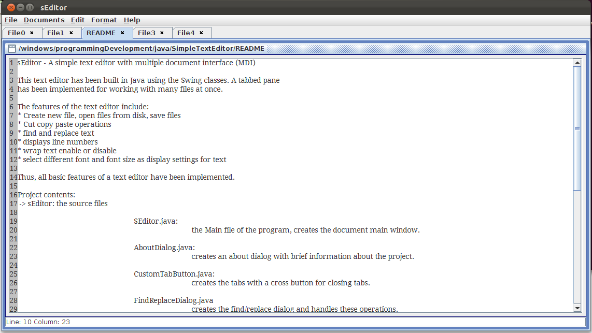

sEditor
=======



## Install and run

```
$ git clone [https://github.com/mhcrnl/simple-text-editor-2.git](https://github.com/mhcrnl/simple-text-editor-2.git)
$ java -jar sEditor.jar
```

Introduction
------------
This is a simple text editor with multiple document interface (MDI), built in Java using the Swing classes. A tabbed pane has been implemented for working with many files at once.

The project has been written, and built using Eclipse IDE for Java Developers (version: Indigo) on Ubuntu 11.10 (64-bit) OS.

Features
--------
* Create new file, open files from disk, save files
* Cut copy paste operations
* find and replace text
* displays line numbers
* wrap text enable or disable
* select different font and font size as display settings for text

Thus, all basic features of a text editor have been implemented.

Project contents:
----------------
-> sEditor: the source file

 * SEditor.java: the Main file of the program, creates the document main window.
 * AboutDialog.java: creates an about dialog with brief information about the project.
 * CustomTabButton.java:creates the tabs with a cross button for closing tabs.
 * FindReplaceDialog.java: creates the find/replace dialog and handles these operations.
 * FontChooser.java: creates font chooser dialog with options to set font, font size and attributes: bold and italics.
 * MenuDetail.java: A structure class for handling details for each menu item.
 * TextArea.java: Creates a text area for each tab, includes file details, line number bar, caret posiiton bar, and undo redo operations support.

-> docs: the javaDoc of the project

-> eEditor.jar: the executable project file
 
The text editor can be run from the command-line by executing:
     `java -jar sEditor.jar`,
provided java is present in the system path. Else full path to java executable has to be given

## Site
[http://javatexteditor.blogspot.ro/](http://javatexteditor.blogspot.ro/)


License
--------
GNU GPLv3
 
